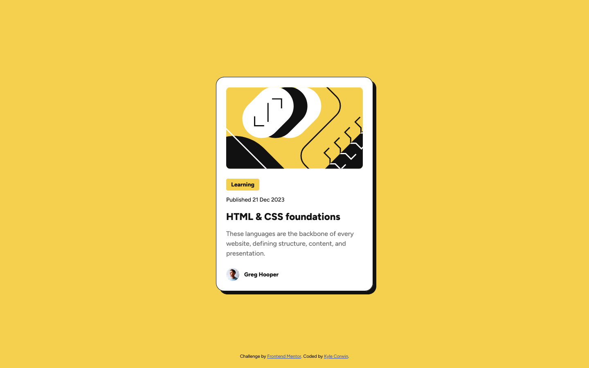
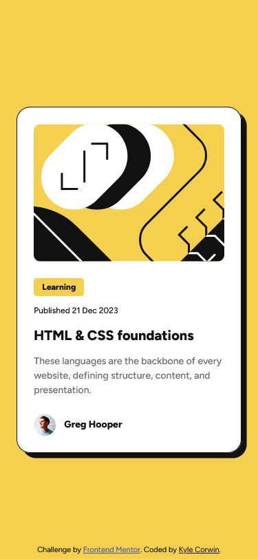

# Frontend Mentor - Blog preview card solution

This is a solution to the [Blog preview card challenge on Frontend Mentor](https://www.frontendmentor.io/challenges/blog-preview-card-ckPaj01IcS). Frontend Mentor challenges help you improve your coding skills by building realistic projects.

## Table of contents

- [Frontend Mentor - Blog preview card solution](#frontend-mentor---blog-preview-card-solution)
  - [Table of contents](#table-of-contents)
  - [Overview](#overview)
    - [The challenge](#the-challenge)
    - [Screenshot](#screenshot)
    - [Links](#links)
  - [My process](#my-process)
    - [Built with](#built-with)
    - [What I learned](#what-i-learned)
    - [Continued development](#continued-development)
    - [Useful resources](#useful-resources)
    - [AI Collaboration](#ai-collaboration)
  - [Author](#author)
  - [Acknowledgments](#acknowledgments)

## Overview

### The challenge

Users should be able to:

- See hover and focus states for all interactive elements on the page

### Screenshot




### Links

- Solution URL: [Blog Preview Card](https://github.com/CaptainKaveman/blog-preview-card)
- Live Site URL: [Live Site](https://captainkaveman.github.io/blog-preview-card/)

## My process

### Built with

- Semantic HTML5 markup
- CSS custom properties
- CSS Variable Fonts
- Flexbox
- Mobile-first workflow

### What I learned

- I learned about self-hosting a variable font with `@font-face` and how the weight range syntax works.
- Mobile-first workflow with a `min-width` media query.
- `object-fit: cover;` for controlling image display without distortion.
- How Figma's "hug" sizing translates to CSS.

```css
@font-face {
  font-family: "Figtree";
  src: url(./assets/fonts/Figtree-VariableFont_wght.ttf) format("truetype");
  font-weight: 100 900;
  font-style: normal;
  font-display: swap;
}
```

### Continued development

- Continue practicing mobile-first workflow.
- Get more comfortable reading and translating Figma designs into code.
- Explore using CSS Grid as an alternative to Flexbox.
- Improve accessibility practices like focus states and Aria attributes.

### Useful resources

- [W3Schools CSS](https://www.w3schools.com/css/) - This was a helpful resource to look up CSS properties.
- [Kevin Powell](https://www.youtube.com/kepowob) - His videos and teaching style make understanding and using CSS a lot simpler. He also is the reason I have gone with a mobile-first workflow, which has made it easier to get responsive designs.

### AI Collaboration

I used Claude (claude.ai) throughout this project for guidance and learning. I used it to ask questions about CSS concepts like variable fonts, rem vs px, and mobile-first workflow rather than having it write code for me. It was helpful for understanding the "why" behind decisions and getting unstuck when something wasn't working as expected.

## Author

- Website - [Kyle Corwin](https://www.kylecor.win)
- Frontend Mentor - [@CaptainKaveman](https://www.frontendmentor.io/profile/CaptainKaveman)
- X - [@KyleCorwin\_](https://www.x.com/KyleCorwin_)

## Acknowledgments

A big thank you to [Kevin Powell](https://www.youtube.com/kepowob) whose YouTube channel and [Conquering Responsive Layouts](https://courses.kevinpowell.co/conquering-responsive-layouts) course have been instrumental in helping me understand CSS and responsive design. His mobile-first approach and teaching style have directly influenced how I write CSS.
